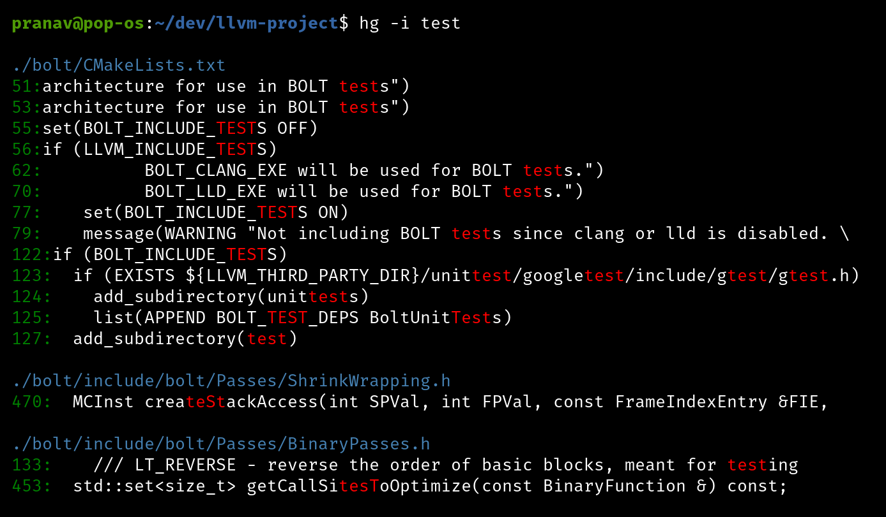

<p align="center">
  
</p>

## Highlights

* Search recursively for a regex pattern using [Intel Hyperscan](https://github.com/intel/hyperscan).
* When a git repository is detected, the repository index is searched using [libgit2](https://github.com/libgit2/libgit2).
* Similar to `grep`, `ripgrep`, `ugrep`, `The Silver Searcher` etc.
* C++17, Multi-threading, SIMD.
* Implementation notes [here](doc/NOTES.md).
* Not cross-platform. Tested in Linux. 

## Example Output

<p>
  
</p>

## Performance

The following tests compare the performance of `hypergrep` against:

* [ripgrep](https://github.com/BurntSushi/ripgrep/) `v11.0.2`
* [ag 2.2.0 (The Silver Searcher)](https://github.com/ggreer/the_silver_searcher) `v2.2.0`
* [ugrep](https://github.com/Genivia/ugrep) `v3.11.2`

### System Details

| Type            | Value |
|:--------------- |:---- |
| Processor       | [11th Gen Intel(R) Core(TM) i9-11900KF @ 3.50GHz   3.50 GHz](https://ark.intel.com/content/www/us/en/ark/products/212321/intel-core-i911900kf-processor-16m-cache-up-to-5-30-ghz.html) |
| Instruction Set Extensions | Intel® SSE4.1, Intel® SSE4.2, Intel® AVX2, Intel® AVX-512 |
| Installed RAM   | 32.0 GB (31.9 GB usable) |
| SSD             | [ADATA SX8200PNP](https://www.adata.com/upload/downloadfile/Datasheet_XPG%20SX8200%20Pro_EN_20181017.pdf) |
| OS              | Ubuntu 20.04 LTS |
| C++ Compiler    | g++ (Ubuntu 11.1.0-1ubuntu1-20.04) 11.1.0 |

### Vcpkg Installed Libraries

[vcpkg](https://github.com/microsoft/vcpkg) commit: [2718aa52](https://github.com/microsoft/vcpkg/commit/2718aa52a31977b792af7e9c2f83eaf4ddcd932d)

| Library | Version | 
|:---|:---|
| **argparse** | 2.9 |
| **concurrentqueue** | 1.0.3 |
| **fmt** | 10.0.0 |
| **hyperscan** | 5.4.2 |
| **libgit2** | 1.4.2 |

### Single Large File Search: `OpenSubtitles.raw.en.txt`

 The following searches are performed on a single large file cached in memory (~13GB, [`OpenSubtitles.raw.en.gz`](http://opus.nlpl.eu/download.php?f=OpenSubtitles/v2018/mono/OpenSubtitles.raw.en.gz)).

| Regex | Line Count | ag | ugrep | ripgrep | hypergrep |
| :---| ---:| ---:| ---:| ---:| ---:|
| Count number of times Holmes did something<br/>`hg -c 'Holmes did \w'` | 27 | n/a | 1.820 | 1.400 | **0.696**  |
| Literal with Regex Suffix<br/>`hg -nw 'Sherlock [A-Z]\w+' en.txt` | 7882 | n/a | 1.812 | 2.654 | **0.803** |
| Simple Literal<br/>`hg -nw 'Sherlock Holmes' en.txt` | 7653 | 15.764 | 1.888 | 1.813 | **0.658** |
| Simple Literal (case insensitive)<br/>`hg -inw 'Sherlock Holmes' en.txt` | 7871 | 15.599 | 6.945 | 2.139 | **0.650** |
| Alternation of Literals<br/>`hg -n 'Sherlock Holmes\|John Watson\|Irene Adler\|Inspector Lestrade\|Professor Moriarty' en.txt` | 10078 | n/a | 6.886 | 1.808 | **0.689** |
| Alternation of Literals (case insensitive)<br/>`hg -in 'Sherlock Holmes\|John Watson\|Irene Adler\|Inspector Lestrade\|Professor Moriarty' en.txt` | 10333 | n/a | 7.029 | 3.880 | **0.770** |
| Words surrounding a literal string<br/>`hg -n '\w+[\x20]+Holmes[\x20]+\w+' en.txt` | 5020 | n/a | 6m 11s | 1.812 | **0.638** |

### Git Repository Search: `torvalds/linux`

The following searches are performed on the entire [Linux kernel source tree](https://github.com/torvalds/linux) (after running `make defconfig && make -j8`). The commit used is [f1fcb](https://github.com/torvalds/linux/commit/f1fcbaa18b28dec10281551dfe6ed3a3ed80e3d6).

| Regex | Line Count | ag | ugrep | ripgrep | hypergrep |
| :---| ---:| ---:| ---:| ---:| ---:|
| Simple Literal<br/>`hg -nw 'PM_RESUME'` | 9 | 2.807 | 0.316 | 0.198 | **0.140** |
| Simple Literal (case insensitive)<br/>`hg -niw 'PM_RESUME'` | 39 | 2.904 | 0.435 | 0.203 | **0.141** |
| Regex with Literal Suffix<br/>`hg -nw '[A-Z]+_SUSPEND'` | 538 | 3.080 | 1.452 | 0.198 | **0.143** |
| Alternation of four literals<br/>`hg -nw '(ERR_SYS\|PME_TURN_OFF\|LINK_REQ_RST\|CFG_BME_EVT)'` | 16 | 3.085 | 0.410 | 0.407 | **0.146** |
| Unicode Greek<br/>`hg -n '\p{Greek}'` | 111 | 3.762 | 0.484 | 0.386 | **0.146** |

### Git Repository Search: `apple/swift`

The following searches are performed on the entire [Apple Swift source tree](https://github.com/apple/swift). The commit used is [3865b](https://github.com/apple/swift/commit/3865b5de6f2f56043e21895f65bd0d873e004ed9).

| Regex | Line Count | ag | ugrep | ripgrep | hypergrep |
| :---| ---:| ---:| ---:| ---:| ---:|
| Function/Struct/Enum declaration followed by a valid identifier and opening parenthesis<br/>`hg -n '(func\|struct\|enum)\s+[A-Za-z_][A-Za-z0-9_]*\s*\('` | 59009 | 1.148 | 0.954 | 0.184 | **0.090** |
| Words starting with alphabetic characters followed by at least 2 digits<br/>`hg -nw '[A-Za-z]+\d{2,}'` | 127855 | 1.169 | 1.238 | 0.186 | **0.095** |
| Workd starting with Uppercase letter, followed by alpha-numeric chars and/or underscores <br/>`hg -nw '[A-Z][a-zA-Z0-9_]*'` | 2012263 | 3.131 | 2.598 | 0.673 | **0.482** |
| Guard let statement followed by valid identifier<br/>`hg -n 'guard\s+let\s+[a-zA-Z_][a-zA-Z0-9_]*\s*=\s*\w+'` | 857 | 0.828 | 0.174 | 0.072 | **0.047** |

### Directory Search: `/usr`

The following searches are performed on the `/usr` directory. 

| Regex | Line Count | ag | ugrep | ripgrep | hypergrep |
| :---| ---:| ---:| ---:| ---:| ---:|
| Any HTTPS or FTP URL<br/>`hg "(https?\|ftp)://[^\s/$.?#].[^\s]*"` | 13683 | 4.597 | 2.894 | 0.358 | **0.176** |
| Any IPv4 IP address<br/>`hg -w "(?:\d{1,3}\.){3}\d{1,3}"` | 12641 | 4.727 | 2.340 | 0.380 | **0.177** |
| Any E-mail address<br/>`hg -w "[A-Za-z0-9._%+-]+@[A-Za-z0-9.-]+\.[A-Za-z]{2,}"` | 47507 | 5.477 | 37.209 | 0.542 | **0.254** |
| Any valid date `MM/DD/YYYY`<br/>`hg "(0[1-9]\|1[0-2])/(0[1-9]\|[12]\d\|3[01])/(19\|20)\d{2}"` | 114 | 4.239 | 1.827 | 0.303 | **0.167** |
| Count the number of HEX values<br/>`hg -cw "(?:0x)?[0-9A-Fa-f]+"` | 68401 | 5.765 | 28.691 | 1.662 | **0.660** |
| Search any C/C++ for a literal<br/>`hg --filter "\.(c\|cpp\|h\|hpp)$" test` | 7356 | n/a | 0.505 | 0.140 | **0.086** | 

## Build

### Install Dependencies with `vcpkg`

```bash
git clone https://github.com/microsoft/vcpkg
cd vcpkg
./bootstrap-vcpkg.sh
./vcpkg install concurrentqueue fmt argparse libgit2 hyperscan
```

### Build `hypergrep` using `cmake` and `vcpkg`

```
git clone https://github.com/p-ranav/hypergrep
cd hypergrep
mkdir build
cd build
cmake -DCMAKE_TOOLCHAIN_FILE=<path_to_vcpkg>/scripts/buildsystems/vcpkg.cmake ..
make
```
