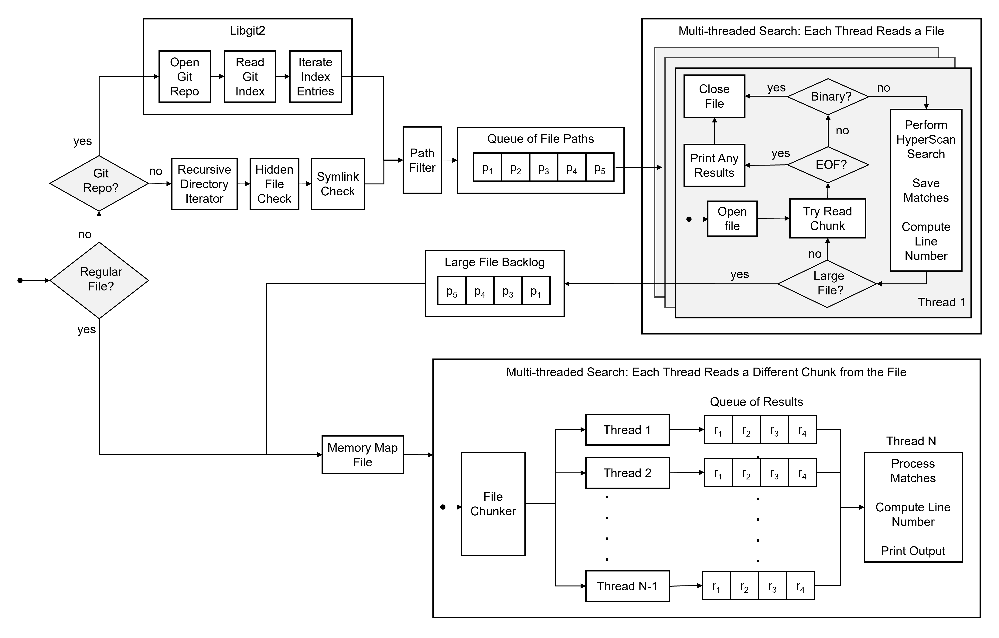

<p align="center">
  
</p>

## Highlights

* Search files and directories for a regex pattern using [Intel Hyperscan](https://github.com/intel/hyperscan)
* When a git repository is detected, the repository index is searched using [libgit2](https://github.com/libgit2/libgit2)
* Print line numbers, search case insensitively, exclude git submodules, and filter paths with regex pattern  
* Similar to `grep`, `ripgrep`, etc.

## Performance

The following tests compare the performance of `hypergrep` with `ripgrep 11.0.2`

### System Details

| Type            | Value |
|:--------------- |:---- |
| Processor       | [11th Gen Intel(R) Core(TM) i9-11900KF @ 3.50GHz   3.50 GHz](https://ark.intel.com/content/www/us/en/ark/products/212321/intel-core-i911900kf-processor-16m-cache-up-to-5-30-ghz.html) |
| Instruction Set Extensions | Intel® SSE4.1, Intel® SSE4.2, Intel® AVX2, Intel® AVX-512 |
| Installed RAM   | 32.0 GB (31.9 GB usable) |
| SSD             | [ADATA SX8200PNP](https://www.adata.com/upload/downloadfile/Datasheet_XPG%20SX8200%20Pro_EN_20181017.pdf) |
| OS              | Ubuntu 20.04 LTS |
| C++ Compiler    | g++ (Ubuntu 11.1.0-1ubuntu1-20.04) 11.1.0 |

### Directory Search: `torvalds/linux`

The following searches are performed on the entire [Linux kernel source tree](https://github.com/torvalds/linux) (after running `make defconfig && make -j8`).

| Regex | Line Count | ripgrep | hypergrep |
| :---| ---:| ---:| ---:|
| Simple Literal<br/>`hg -nw 'PM_RESUME'` | 9 | 0.209 | **0.152** |
| Simple Literal (case insensitive)<br/>`hg -niw 'PM_RESUME'` | 39 | 0.209 | **0.156** |
| Regex with Literal Suffix<br/>`hg -nw '[A-Z]+_SUSPEND'` | 538 | 0.216 | **0.159** |
| Alternation of four literals<br/>`hg -nw '(ERR_SYS\|PME_TURN_OFF\|LINK_REQ_RST\|CFG_BME_EVT)'` | 16 | 0.417 | **0.162** |
| Unicode Greek<br/>`hg -n '\p{Greek}'` | 105 | 0.397 | **0.160** |

### Directory Search: `apple/swift`

The following searches are performed on the entire [Apple Swift source tree](https://github.com/apple/swift).

| Regex | Line Count | ripgrep | hypergrep |
| :---| ---:| ---:| ---:|
| Function/Struct/Enum declaration followed by a valid identifier and opening parenthesis<br/>`hg -nw '(func\|struct\|enum)\s+[A-Za-z_][A-Za-z0-9_]*\s*\('` | 58934 | 0.189 | **0.104** |
| Words starting with alphabetic characters followed by at least 2 digits<br/>`hg -nw '-nw [A-Za-z]+\d{2,}'` | 127750 | 0.186 | **0.145** |
| Workd starting with Uppercase letter, followed by alpha-numeric chars and/or underscores <br/>`hg -nw '[A-Z][a-zA-Z0-9_]*'` | 2011521 | 0.711 | 0.708 |
| Guard let statement followed by valid identifier<br/>`hg -n 'guard\s+let\s+[a-zA-Z_][a-zA-Z0-9_]*\s*=\s*\w+'` | 857 | 0.072 | **0.048** |

### Single Lrage File Search: `OpenSubtitles.raw.en.txt`

 The following searches are performed on a single large file cached in memory (~13GB, [`OpenSubtitles.raw.en.gz`](http://opus.nlpl.eu/download.php?f=OpenSubtitles/v2018/mono/OpenSubtitles.raw.en.gz)).

| Regex | Line Count | ripgrep | hypergrep |
| :---| ---:| ---:| ---:|
| Literal with Regex Suffix<br/>`hg -w 'Sherlock [A-Z]\w+' en.txt` | 7882 | 2.514 | **0.736** |
| Literal with Regex Suffix (with line number)<br/>`hg -nw 'Sherlock [A-Z]\w+' en.txt` | 7882 | 3.272 | **2.168** |
| Simple Literal<br/>`hg -nw 'Sherlock Holmes' en.txt` | 7653 | 2.411 | **2.179** |
| Simple Literal (case insensitive)<br/>`hg -inw 'Sherlock Holmes' en.txt` | 7871 | 2.773 | **2.167** |
| Alternation of Literals<br/>`hg -n 'Sherlock Holmes\|John Watson\|Irene Adler\|Inspector Lestrade\|Professor Moriarty' en.txt` | 10078 | 2.542 | **2.169** |
| Alternation of Literals (case insensitive)<br/>`hg -in 'Sherlock Holmes\|John Watson\|Irene Adler\|Inspector Lestrade\|Professor Moriarty' en.txt` | 10333 | 4.642 | **2.182** |
| Words surrounding a literal string<br/>`hg -n '\w+[\x20]+Holmes[\x20]+\w+' en.txt` | 5020 | 2.266 | 2.205 |

## Workflow



## Build

### Install Dependencies with `vcpkg`

```bash
git clone https://github.com/microsoft/vcpkg
cd vcpkg
./bootstrap-vcpkg.sh
./vcpkg install concurrentqueue fmt argparse libgit2 hyperscan
```

### Build `hypergrep` using CMake

```
git clone https://github.com/p-ranav/hypergrep
cd hypergrep
mkdir build
cd build
cmake -DCMAKE_TOOLCHAIN_FILE=<path_to_vcpkg>/scripts/buildsystems/vcpkg.cmake ..
make
```
