# Table of Contents

- [Getting Started](#getting-started)
  * [Simple Search](#simple-search)
  * [Searching Multiple Paths](#searching-multiple-paths)
  * [Multiple Patterns](#multiple-patterns)
    - [Patterns in the command line (`-e/--regexp`)](#patterns-in-the-command-line-with--e--regexp-option)
    - [Patterns in a PATTERNFILE (`-f/--file`)](#patterns-in-a-pattern-file-with--f--file-option)
  * [Search Options](#search-options)
    - [Byte Offset (`--byte-offset`)](#byte-offset)
    - [Column Number (`--column`)](#column-number)
    - [Count Matching Lines (`-c/--count`)](#count-matching-lines)
    - [Count Matches (`--count-matches`)](#count-matches)
    - [Fixed Strings (`--fixed-strings`)](#fixed-strings)
    - [Ignore Case (`-i/--ignore-case`)](#ignore-case)
    - [Limit Output Line Length (`--max-columns`)](#limit-output-line-length)
    - [Print Only Matching Parts (`-o/--only-matching`)](#print-only-matching-parts)
    - [Trim Whitespace (`--trim`)](#trim-whitespace)
    - [Word Boundary (`-w/--word-regexp`)](#word-boundary)
  * [Unicode](#unicode)
  * [Which Files?](#which-files)
    - [List Files Without Searching (`--files`)](#list-files-without-searching)
    - [List Files With Matches (`-l/--files-with-matches`)](#list-files-with-matches)
    - [Filtering Files (`--filter`)](#filtering-files)
    - [Negating the Filter](#negating-the-filter)
    - [Hidden Files (`--hidden`)](#hidden-files)
    - [Limiting File Size (`--max-filesize`)](#limiting-file-size)
  * [Git Repositories](#git-repositories)
    - [Ignore Submodules](#ignore-submodules) 
    - [Ignore Git Index](#ignore-git-index)
- [Usage](#usage)
- [Options](#options)

# Getting Started

The program can be used in a few different ways:

1. Single pattern, searching a single path (if no path is provided, the current directory is searched).
1. Single pattern, searching multiple paths.
2. Multiple patterns provided via `-e` option, searching multiple paths.
3. Multiple patterns provided via a pattern file, searching multiple paths.
4. No patterns, just interested in what files _will_ be searched (using `--files`)

A list of supported regex constructs can be found [here](https://intel.github.io/hyperscan/dev-reference/compilation.html#supported-constructs).

## Simple Search

The simplest of these is searching the current working directory for a single pattern. The following example searches the current directory for the literal pattern `mmap`.
  
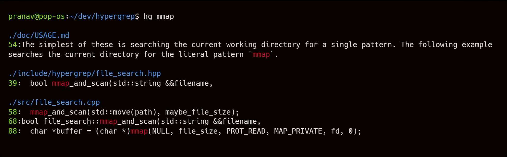
  
The output indicates 4 matches across 2 different files.
  
When piping `hypergrep` output to another program, e.g., `wc` or `cat`, the output changes to a different format where each line represents a line of output. 
  
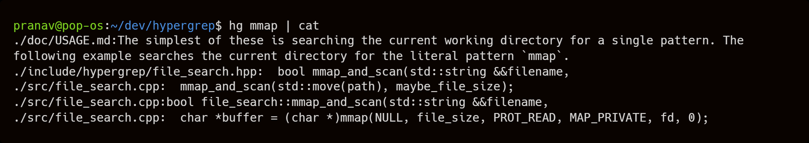

## Searching Multiple Paths

To search multiple paths for a pattern match, simply provide the paths one after another, e.g.,

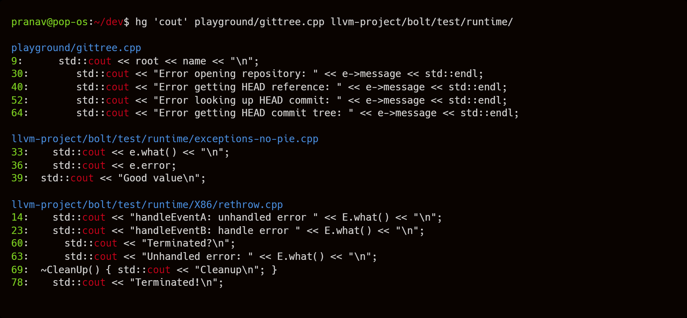
  
## Multiple Patterns
  
Multiple independent patterns can be provided in two ways: 

1. Using `-e/--regexp` and providing each pattern in the command line
2. Using `-f/--file` and providing a pattern file, which contains multiple patterns, one per line. 

### Patterns in the command line with `-e/--regexp` option

Use `-e` to provide multiple patterns, one after another, in the same command

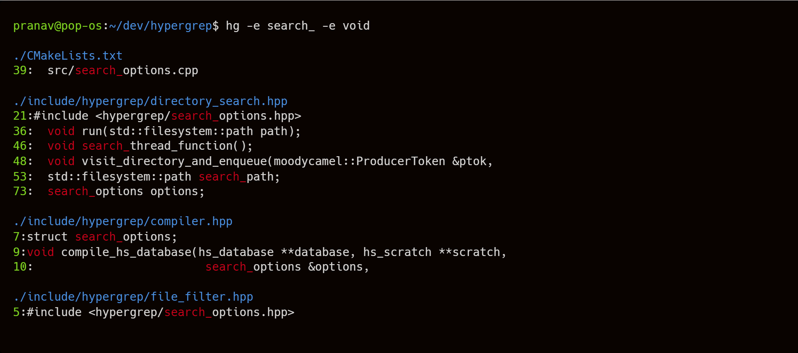

### Patterns in a pattern file with `-f/--file` option

Consider the pattern file `list_of_patterns.txt` with two lines:

```txt
hs_scan
fmt::print\("{}"
```

This file can be used to search multiple patterns at once using the `-f/--file` option:

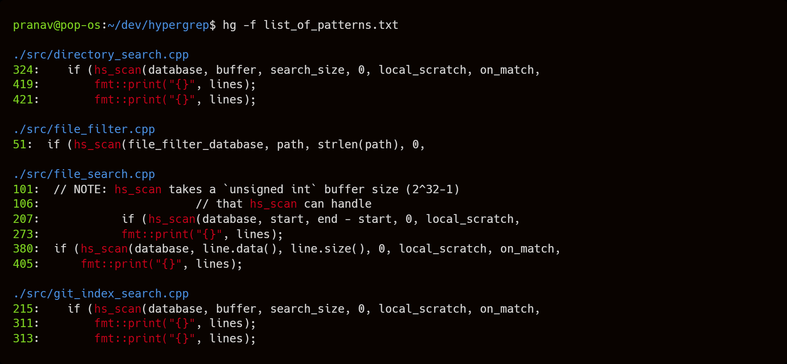

## Search Options

### Byte Offset
  
In addition to line numbers, the byte offset or the column number can be printed for each matching line.

Use `-b/--byte-offset` to get the 0-based byte offset of the matching line in the file. 

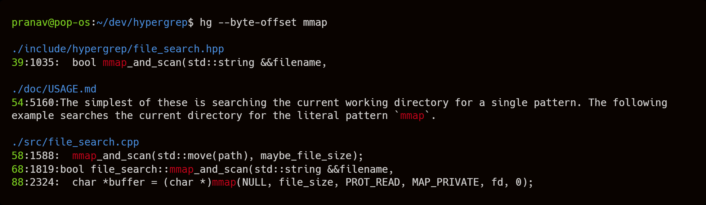

### Column Number
  
Use `--column` to get the 1-based column number for the first-match in any matching line.

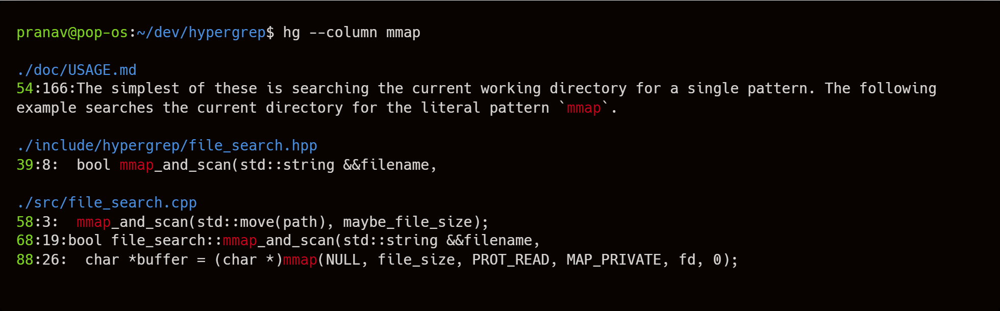

### Count Matching Lines

Use `-c/--count` to count the number of matching lines in each file. Note that multiple matches per line still counts as 1 matching line.


### Count Matches

Use `--count-matches` to count the number of matches in each file. If there are multiple matches per line, these are individually counted.

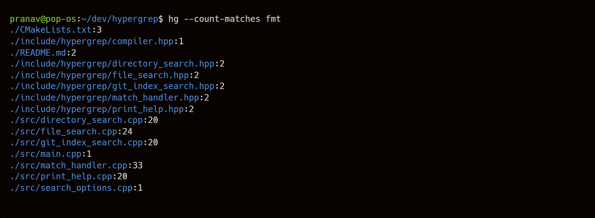

### Fixed Strings

Pure literal is a special case of regular expression. A character sequence is regarded as a pure literal if and only if each character is read and interpreted independently. No syntax association happens between any adjacent characters.

For example, given an expression written as `/bc?/`. We could say it is a regular expression, with the meaning that character `b` followed by nothing or by one character `c`. On the other view, we could also say it is a pure literal expression, with the meaning that this is a character sequence of `3-byte` length, containing characters `b`, `c` and `?`. In regular case, the question mark character `?` has a particular syntax role called `0-1` quantifier, which has a syntax association with the character ahead of it. Similar characters exist in regular grammar like `[`, `]`, `(`, `)`, `{`, `}`, `-`, `*`, `+`, `\`, `|`, `/`, `:`, `^`, `.`, `$`. While in pure literal case, all these meta characters lost extra meanings expect for that they are just common ASCII codes.

Use `-F/--fixed-strings` to specify that the regex pattern is a pure literal. Note in the following example that the special characters in the pattern are not escaped - they are considered as is.

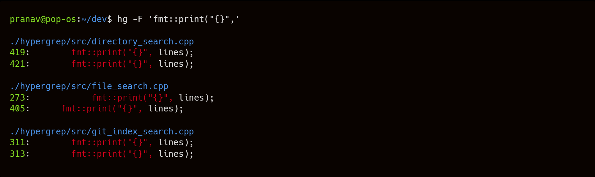

### Ignore Case

`hypergrep` search can be performed case-insensitively using the `-i/--ignore-case` option. Here's an example search for both the upper-case (`Δ`) and lower-case (`δ`) version of the greek letter delta.

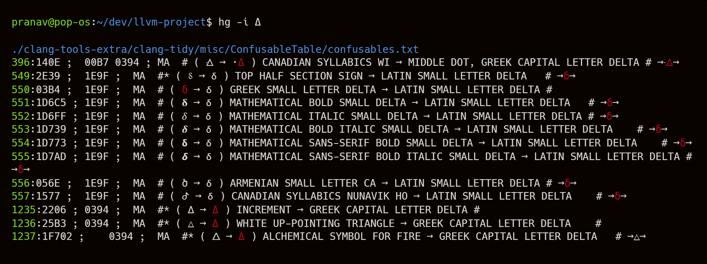

### Limit Output Line Length

If some of the matching lines are too long for you, you can hide them with `--max-columns` and set the maximum line length for any matching line (in bytes). Lines longer than this limit will not be printed. Instead, a "Omitted line" message is printed along with the number of matches on each of these lines.

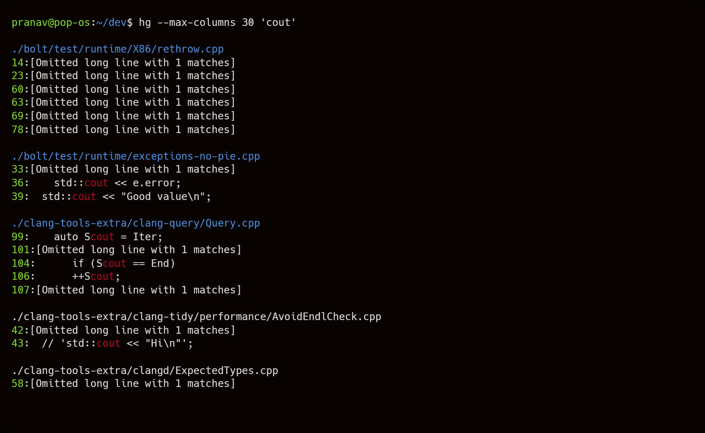

### Print Only Matching Parts

Sometimes, a user does not care about the entire line but only the matching parts. Here's an example, using `-o/--only-matching` to only print the matching parts of the line, instead of the entire line. 

This example searches for any `cout` statement that ends in a `std::endl`.

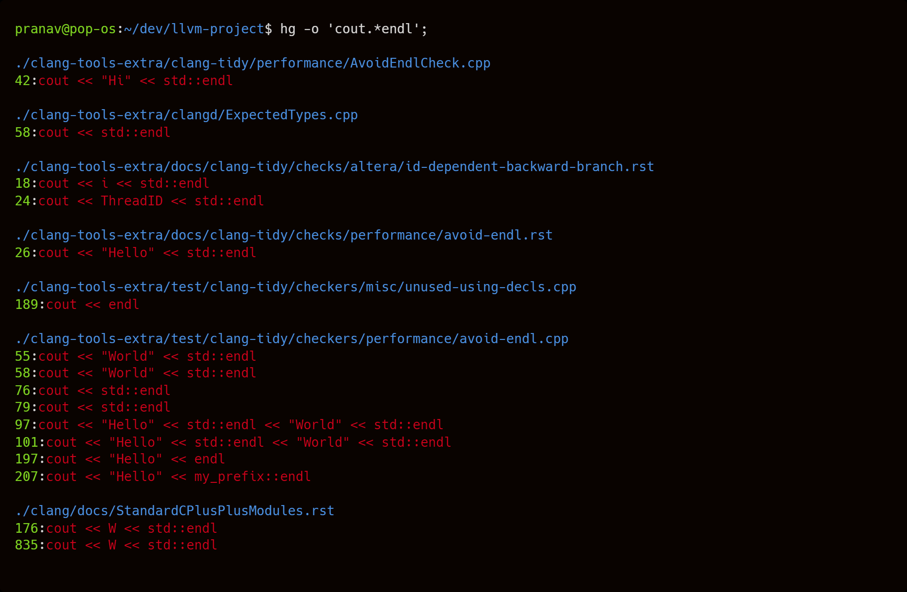

### Trim Whitespace

Use `--trim` to trim whitespace (`' '`, `\t`) that prefixes any matching line. 

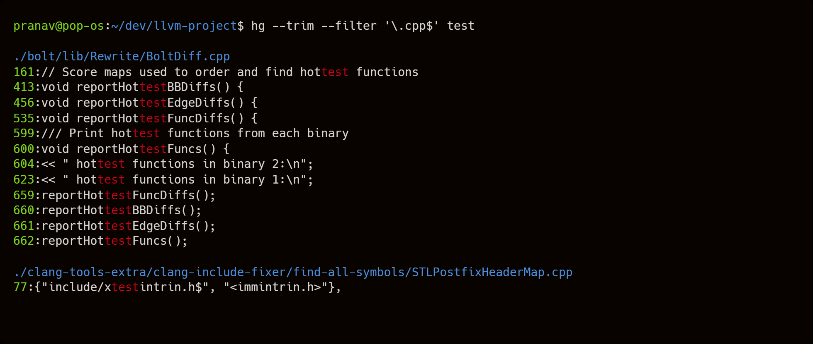

### Word Boundary

In regex, simply adding `\b` allows you to perform a “whole words only” search using a regular expression in the form of `\bword\b`. A "word character" is a character that can be used to form words.

Use `-w/--word-regexp` as a short-hand for this purpose. "Whole words only!"

There are three different positions that qualify as word boundaries:

1. Before the first character in the string, if the first character is a word character.
2. After the last character in the string, if the last character is a word character.
3. Between two characters in the string, where one is a word character and the other is not a word character.

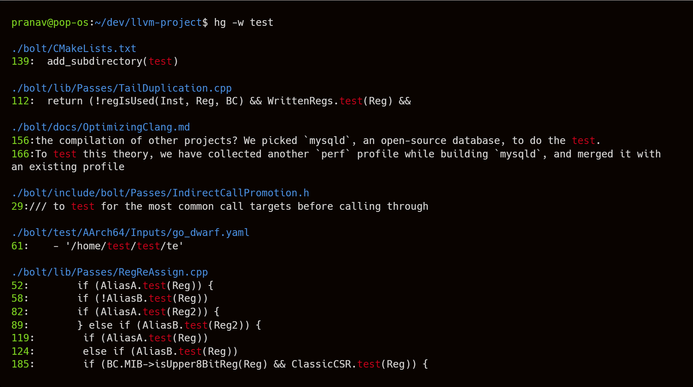

NOTE `\B` is the negated version of `\b`. `\B` matches at every position where `\b` does not. Effectively, `\B` matches at any position between two word characters as well as at any position between two non-word characters. 

In the following example, any occurrence of `test` that isn't surrounded by word characters will be matched. Note that in the final matching line, there are two occurrences of `test` but only one matches.

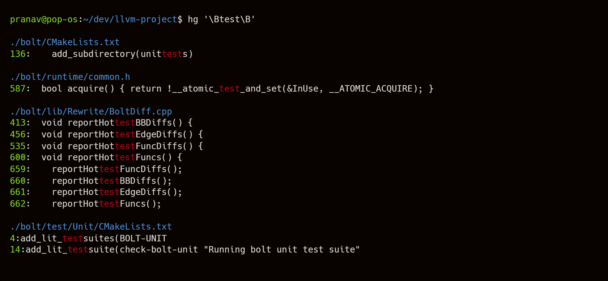

## Unicode

`hypergrep` regex engine is compiled with UTF8 support, i.e., patterns are treated as a sequence of UTF-8 characters. 

Unicode character properties, such as `\p{L}`, `\P{Sc}`, `\p{Greek}` etc., are supported.

Here's an example search for a range of emojis:

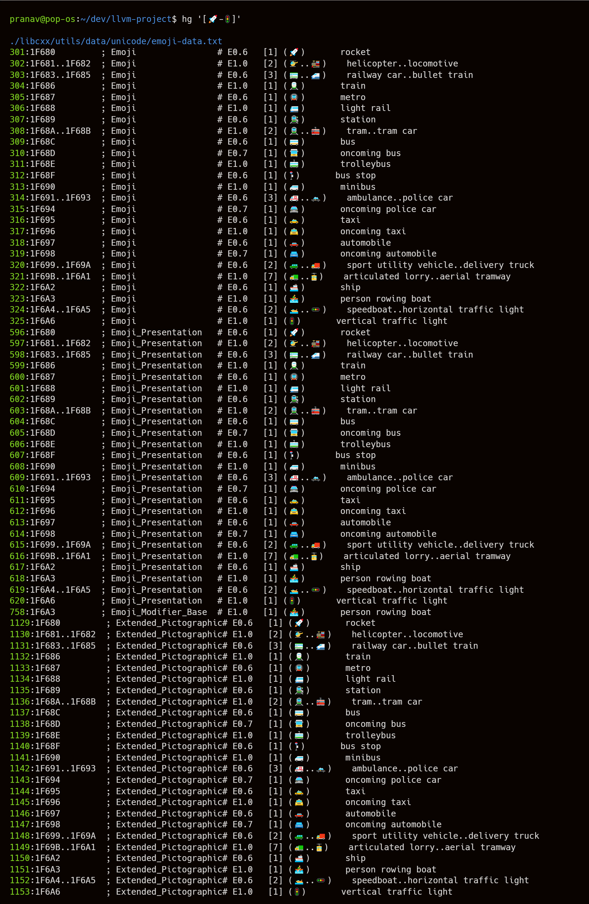

NOTE: You can specify the `--ucp` flag use Unicode properties, rather than the default ASCII interpretations, for character mnemonics like `\w` and `\s` as well as the POSIX character classes.

## Which Files?

### List Files Without Searching

Sometimes, it is necessary to check which files `hypergrep` chooses to search in any directory. Use `--files` to print a list of all files that `hypergrep` will consider.

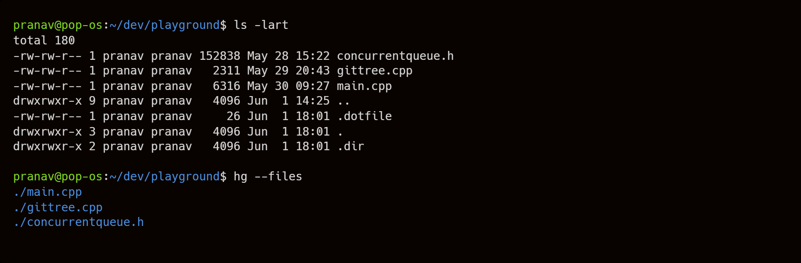

Note in the above example that hidden files and directories are ignored by default.

### List Files With Matches

If you only care about which files have the matches, and not necessarily what the matches are, use `-l/--files-with-matches` to get a list of all the files with matches.

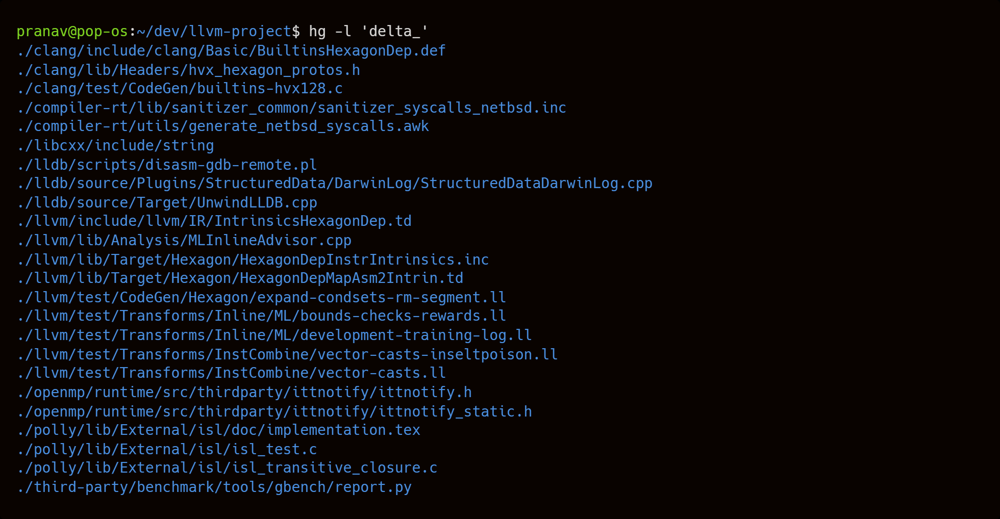

### Filtering Files

Use `--filter` to filter the files being searched. Only files that positively match the filter pattern will be searched. 


NOTE that this is not a glob pattern but a PCRE pattern.

The following pattern, `googletest/(include|src)/.*\.(cpp|hpp|c|h)$`, matches any C/C++ source file in any `googletest/include` and `googletest/src` subdirectory. 

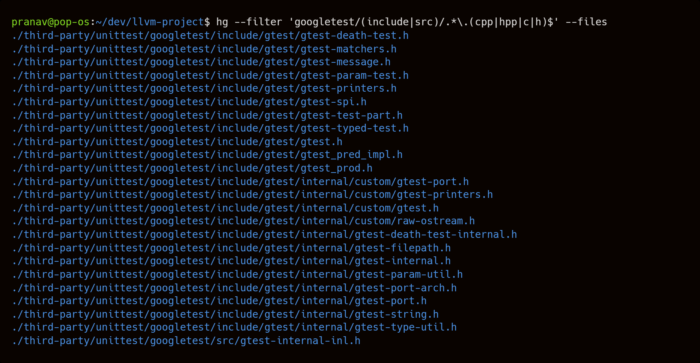

Running in the `/usr` directory and searching for any shared library, here's the performance:

| Command | Number of Files | Time |
| --- | --- | --- |
| `find . -name "*.so" \| wc -l` | 1851	| 0.293 |	
| `rg -g "*.so" --files \| wc -l` | 1621 | 0.082 |
| `hg --filter '\.so$' --files \| wc -l` | 1621 | **0.043** |

### Negating the Filter

This sort of filtering can be negated by prefixing the filter with the `!` character, e.g.,: the pattern `!\.(cpp|hpp)$` will match any file that is NOT a C++ source file.

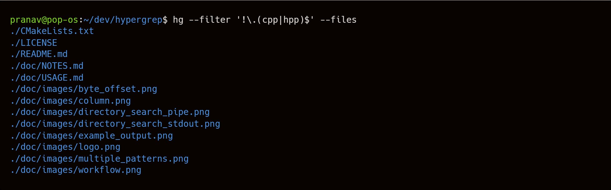

### Hidden Files

By default, hidden files and directories are skipped. A file or directory is considered hidden if its base name starts with a dot character (`'.'`).

You can include hidden files and directories in the search using the `--hidden` option. 

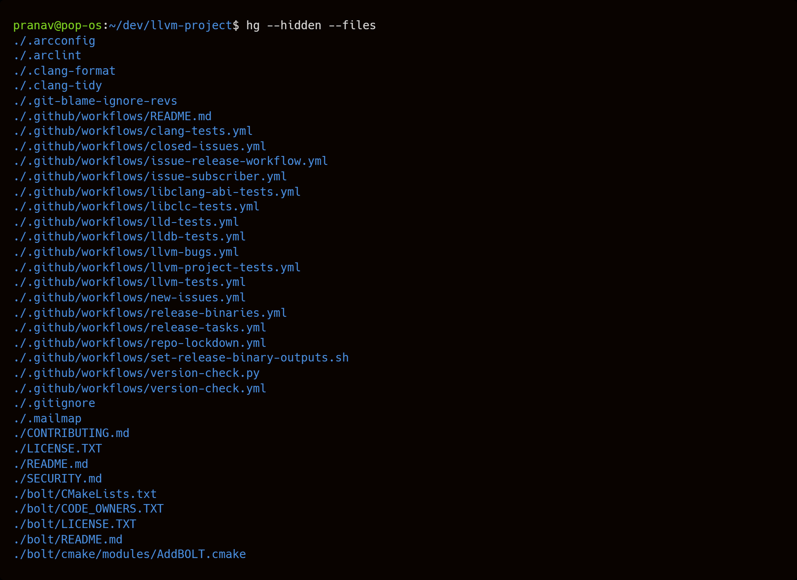

### Limiting File Size

If you want to filter out files over a certain size, you can use `--max-filesize` to provide a file size specification. The input accepts suffixes of form `K`, `M` or `G`. 

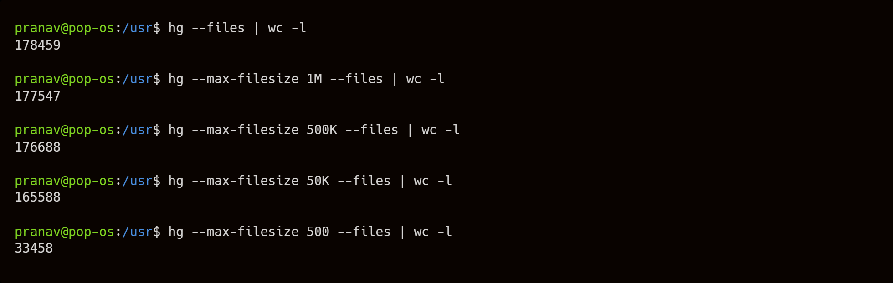

If no suffix is provided the input is treated as bytes e.g., the following search filters out any files over 30 bytes in size.

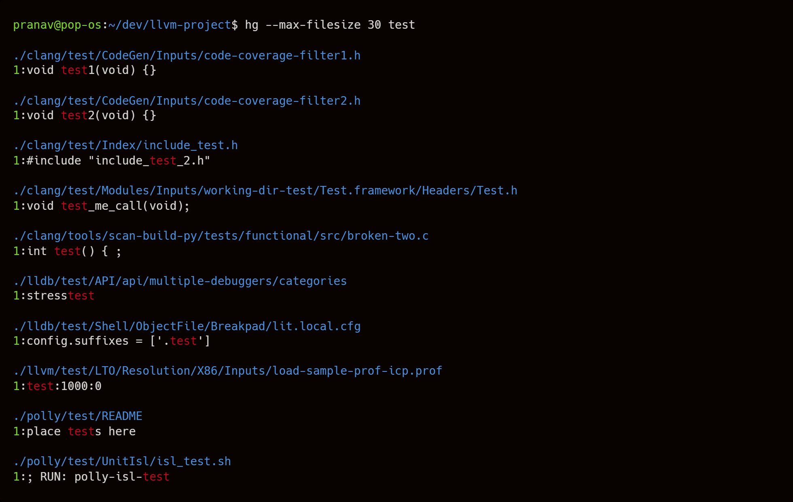

## Git Repositories

`hypergrep` treats git repositories, i.e., directories with a `.git/` subdirectory, differently to other ordinary directories. When `hypergrep` encounters a git repository, instead of traversing the directory tree, the program reads the git index file of the repository (at `.git/index`) and iterates the index entries using [libgit2](https://libgit2.org/libgit2/).

NOTE in the following example:

1. `ls` command shows all the files and directories in the current path
   - Note the `build/` folder 
2. `git ls-files` shows all the files in the git index and the working tree
3. `hg --files` output is very similar to `git ls-files` except that hidden files are ignored. 

`hypergrep` prefers this approach of iterating the git index rather than loading the `.gitignore` file and checking every single file and subdirectory against a potentially long list of ignore rules.

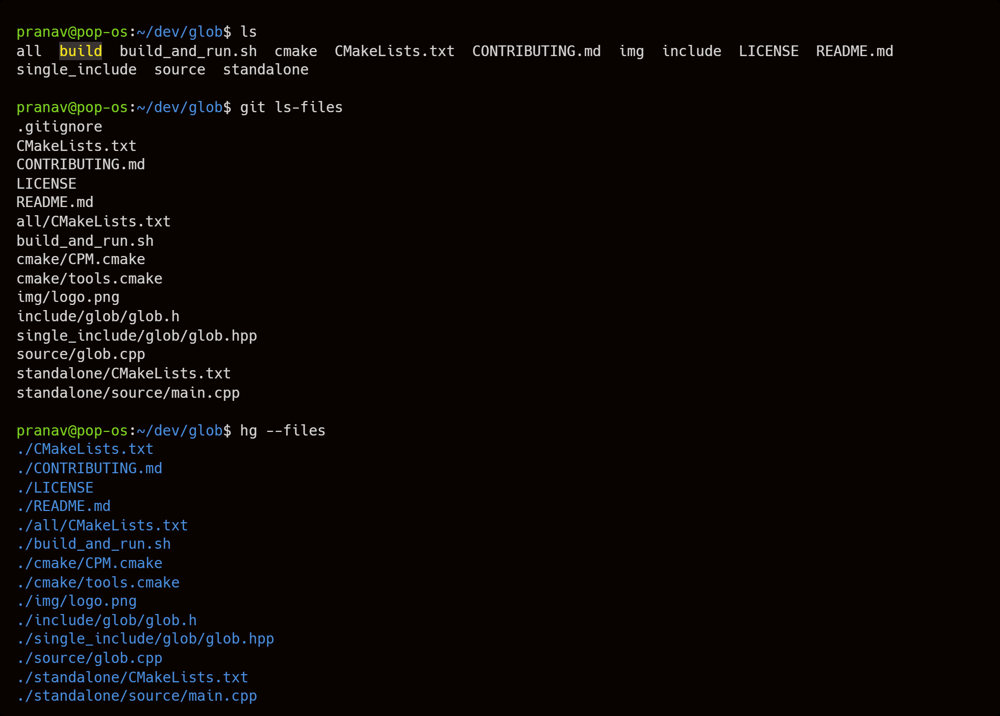

### Ignore Submodules

TODO

### Ignore Git Index

TODO

# Usage

```bash
hg [OPTIONS] PATTERN [PATH ...]
hg [OPTIONS] -e PATTERN ... [PATH ...]
hg [OPTIONS] -f PATTERNFILE ... [PATH ...]
hg [OPTIONS] --files [PATH ...]
hg [OPTIONS] --help
hg [OPTIONS] --version
```

# Options

| Name | Description | 
| --- | --- |
| `-b, --byte-offset` | Print the 0-based byte offset within the input file before each line of output. If `-o` (`--only-matching`) is used, print the offset of the matching part itself. |
| `--column` | Show column numbers (1-based). This only shows the column numbers for the first match on each line. |
| `-c, --count` | This flag suppresses normal output and shows the number of lines that match the given pattern for each file searched | 
| `--count-matches` | This flag suppresses normal output and shows the number of individual matches of the given pattern for each file searched | 
| `-e, --regexp <PATTERN>...` | A pattern to search for. This option can be provided multiple times, where all patterns given are searched. Lines matching at least one of the provided patterns are printed, e.g.,<br/><br/>`hg -e 'myFunctionCall' -e 'myErrorCallback'`<br/><br/>will search for any occurrence of either of the patterns. |
| `-f, --files <PATTERNFILE>...` | Search for patterns from the given file, with one pattern per line. When this flag is used multiple times or in combination with the `-e/---regexp` flag, then all patterns provided are searched. |
| `--files` | Print each file that would be searched without actually performing the search |
| `--filter <FILTERPATTERN>` | Filter paths based on a regex pattern, e.g.,<br/><br/>`hg --filter '(include\|src)/.*\.(c\|cpp\|h\|hpp)$'`<br/><br/>will search C/C++ files in the any `*/include/*` and `*/src/*` paths.<br/><br/>A filter can be negated by prefixing the pattern with !, e.g.,<br/><br/>`hg --filter '!\.html$'`<br/><br/>will search any files that are not HTML files. |
| `-F, --fixed-strings` | Treat the pattern as a literal string instead of a regex. Special regex meta characters such as `.(){}*+` do not need to be escaped. |
| `-h, --help` | Display help message. |
| `--hidden` | Search hidden files and directories. By default, hidden files and directories are skipped. A file or directory is considered hidden if its base name starts with a dot character (`'.'`). |
| `-i, --ignore-case` | When this flag is provided, the given patterns will be searched case insensitively. The <PATTERN> may still use PCRE tokens (notably `(?i)` and `(?-i)`) to toggle case-insensitive matching. |
| `--ignore-gitindex` | By default, hypergrep will check for the presence of a `.git/` directory in any path being searched. If a `.git/` directory is found, hypergrep will attempt to find and load the git index file. Once loaded, the git index entries will be iterated and searched. Using `--ignore-gitindex` will disable this behavior. Instead, hypergrep will search this path as if it were a normal directory. |
| `--ignore-submodules` | For any detected git repository, this option will cause hypergrep to exclude any submodules found. | 
| `--include-zero` | When used with `--count` or `--count-matches`, print the number of matches for each file even if there were zero matches. This is distabled by default. | 
| `-I, --no-filename` | Never print the file path with the matched lines. This is the default when searching one file or stdin. | 
| `-l, --files-with-matches` | Print the paths with at least one match and suppress match contents. |
| `-M, --max-columns <NUM>` | Don't print lines longer than this limit in bytes. Longer lines are omitted, and only the number of matches in that line is printed. |
| `--max-filesize <NUM+SUFFIX?>` | Ignore files above a certain size. The input accepts suffixes of form `K`, `M` or `G`. If no suffix is provided the input is treated as bytes e.g.,<br/><br/>`hg --max-filesize 50K`<br/><br/>will search any files under `50KB` in size. |
| `-n, --line-number` | Show line numbers (1-based). This is enabled by defauled when searching in a terminal. | 
| `-N, --no-line-number` | Suppress line numbers. This is enabled by default when not searching in a terminal. | 
| `-o, --only-matching` | Print only matched parts of a matching line, with each such part on a separate output line. | 
| `--ucp` | Use unicode properties, rather than the default ASCII interpretations, for character mnemonics like `\w` and `\s` as well as the POSIX character classes. |
| `-v, --version` | Display the version information. |
| `-w, --word-regexp` | Only show matches surrounded by word boundaries. This is equivalent to putting `\b` before and after the the search pattern. |
